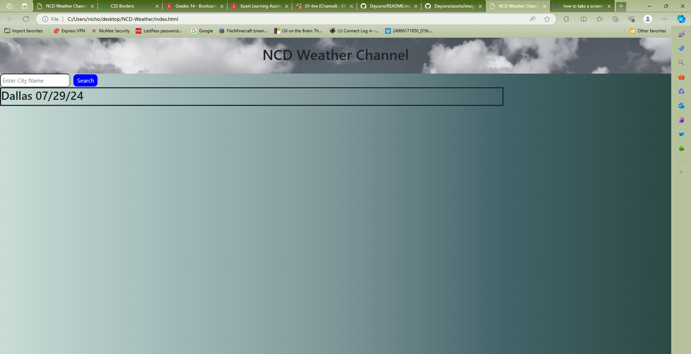

# NCD-Weather

## Description

    This Website is created to show the daily view odf weather in any city that the user choices. You can search any city which the user can see the daily weather. In the right it shows the information in which the city the user looked for. As well As, the information in which ther user input can stay in the local storage if nned to look up city in which it looked for before. In the bootom of the webpage it will show the dailly information of the weather in a more visual way. I learn more about how i can use the web API and involve them into the javascript and make a friendly user website.

## Table of Contents

     N/A

## Installation

    To see or use the NCD Weather website you will need to click the url link in the usage section of the README ME. As well will be provided in the @gunther0662 GitHub.

## Usage

## Credits

    N/A

## License

    MIT License 

## Badge

    N/A

## Feature

    N/A

## How to Contribute

    N/A

## Test

    N/A